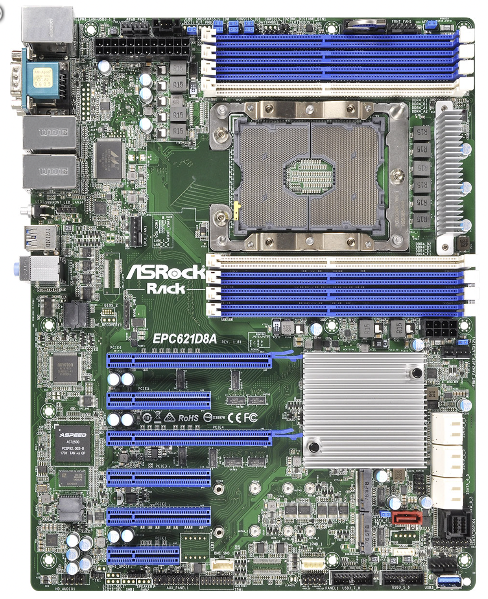

# c621-Hackintosh
cpu w-3265m
mem 32x6 192G reg ecc 
motherboard EPC621D8A
disk 1t sn720&4t HDD
network  4* intel x710 
wireless  intel ax210 
  
1、update config.plist   
2、update OpenCorePkg & Kexts to the latest.  
3、support macOS sonoma 14.1

